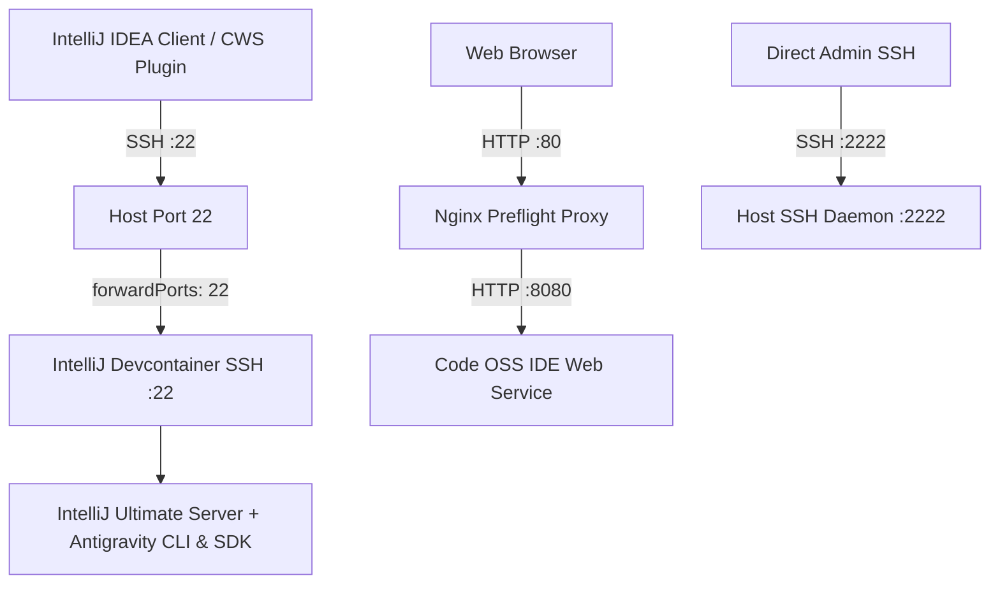

<!--
Copyright 2026 Google LLC

Licensed under the Apache License, Version 2.0 (the "License");
you may not use this file except in compliance with the License.
You may obtain a copy of the License at

    https://www.apache.org/licenses/LICENSE-2.0

Unless required by applicable law or agreed to in writing, software
distributed under the License is distributed on an "AS IS" BASIS,
WITHOUT WARRANTIES OR CONDITIONS OF ANY KIND, either express or implied.
See the License for the specific language governing permissions and
limitations under the License.
-->

# IntelliJ Devcontainer in Code OSS Workstation Image

This module provides a specialized Google Cloud Workstations environment layered on top of the custom Code OSS workstation image (`codeoss`), configured to run an IntelliJ IDEA Ultimate devcontainer with integrated Antigravity CLI and Python SDK.

## Architecture & Features

- **Host Base Layer (Code OSS)**: Based on the `codeoss` custom workstation image, inheriting the web IDE on port 8080, Nginx preflight proxy on port 80, gVisor container isolation, and Docker-in-Docker support.
- **Host SSH Relocation (Port 2222)**: The host container's SSH daemon is reconfigured to listen on port `2222` instead of port `22`. This ensures port `22` is reserved for the devcontainer.
- **IntelliJ Ultimate Devcontainer**: Pre-configures a `.devcontainer` environment based on `us-central1-docker.pkg.dev/cloud-workstations-images/predefined/intellij-ultimate:latest`.
- **Antigravity CLI & Python SDK**: Installs the Antigravity CLI binary (`agy`) and Python SDK (`/opt/antigravity-sdk` with `PYTHONPATH`) directly inside the devcontainer image.
- **SSH Port Forwarding (Port 22)**: Exposes the devcontainer's internal SSH server via `"forwardPorts": [22]`. JetBrains remote development clients (via the Google Cloud Workstations IntelliJ plugin) connecting over SSH on port 22 connect directly into the IntelliJ devcontainer backend.



## Devcontainer Configuration

The devcontainer is defined in `.devcontainer/devcontainer.json` and `.devcontainer/Dockerfile`, and seeded into `/home/user/.devcontainer` on workstation startup.

### Key Components

- **Base Image**: `us-central1-docker.pkg.dev/cloud-workstations-images/predefined/intellij-ultimate:latest`
- **CLI**: Antigravity CLI v1.1.22 (`/usr/local/bin/antigravity-cli`, symlinked to `/usr/local/bin/agy`)
- **SDK**: Antigravity SDK v0.1.15 (`/opt/antigravity-sdk`)
- **Port Forwarding**: Port 22 forwarded from devcontainer to host

## User Guide: Connection & Usage Methods

The workstation provides multiple concurrent interfaces tailored for web-based development, JetBrains remote development, and terminal administration.

---

### 1. Web Browser Access (Code OSS)

Access the integrated web-based Code OSS editor directly through the Google Cloud Workstations web interface:

1. Open the **Google Cloud Console** and navigate to **Cloud Workstations** > **Workstations**.
2. Locate your active workstation and click **Launch**.
3. The Nginx preflight proxy automatically routes port `80` to Code OSS running on port `8080`.

---

### 2. IntelliJ Remote Development via Cloud Workstations Plugin

The IntelliJ devcontainer starts automatically in the background on workstation boot, exposing its internal SSH server on port `22`.

#### Prerequisites

- Install [JetBrains Gateway](https://www.jetbrains.com/remote-development/gateway/) or a compatible JetBrains IDE (IntelliJ IDEA Ultimate).
- Install the **Google Cloud Workstations** plugin from the JetBrains Marketplace.

#### Connection Steps

1. Launch **JetBrains Gateway** on your local workstation.
2. Select **Google Cloud Workstations** from the left navigation panel.
3. Click **Connect to Workstation** and select your GCP Project, Region, Cluster, Configuration, and Workstation instance.
4. The plugin connects over SSH directly to port `22` (forwarded into the IntelliJ Devcontainer) and establishes the JetBrains Client session.

---

### 3. IntelliJ Remote Development via Generic SSH TCP Tunnel

If connecting manually via standard SSH in JetBrains Gateway or third-party SSH clients:

1. **Start the TCP tunnel to port 22**:

   ```bash
   gcloud workstations start-tcp-tunnel \
     --project="<PROJECT_ID>" \
     --region="<REGION>" \
     --cluster="<CLUSTER_NAME>" \
     --config="<CONFIG_NAME>" \
     "<WORKSTATION_NAME>" 22 \
     --local-host-port=localhost:22222
   ```

2. **Connect via JetBrains Gateway**:
   - In **JetBrains Gateway**, select **SSH** > **New Connection**.
   - **Host**: `127.0.0.1`
   - **Port**: `22222`
   - **User**: `user`
   - **Authentication**: Private key or Cloud Workstations credentials.
   - **IDE directory**: `/home/user`

---

### 4. Direct Host Workstation SSH Access (Port 2222)

For direct host container administration, debugging, or terminal workflows:

1. **Start TCP tunnel to host SSH port 2222**:

   ```bash
   gcloud workstations start-tcp-tunnel \
     --project="<PROJECT_ID>" \
     --region="<REGION>" \
     --cluster="<CLUSTER_NAME>" \
     --config="<CONFIG_NAME>" \
     "<WORKSTATION_NAME>" 2222 \
     --local-host-port=localhost:2222
   ```

2. **Connect via SSH**:
   ```bash
   ssh -p 2222 user@127.0.0.1
   ```

---

### 5. Managing the Devcontainer User Service

The devcontainer is managed as a **systemd user service** (`intellij-devcontainer.service`) with user lingering enabled. You can inspect logs, restart, or stop the devcontainer without requiring `sudo`:

```bash
# Check service status
systemctl --user status intellij-devcontainer

# Inspect live supervisor logs
journalctl --user -u intellij-devcontainer -f

# Restart the devcontainer
systemctl --user restart intellij-devcontainer

# Stop the devcontainer
systemctl --user stop intellij-devcontainer

# Start the devcontainer
systemctl --user start intellij-devcontainer
```
