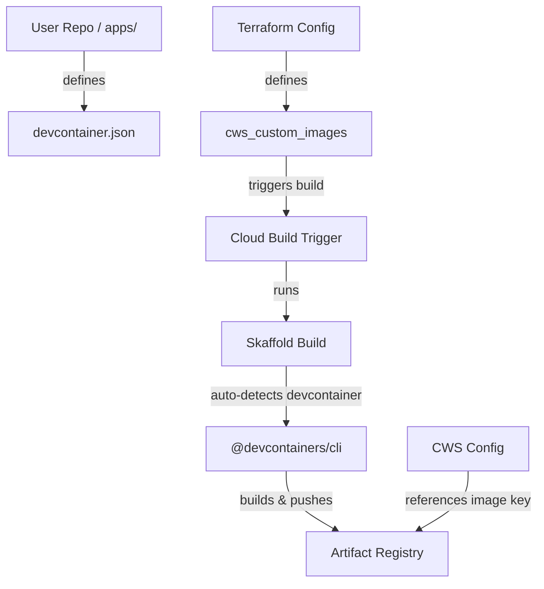

<!--
Copyright 2026 Google LLC

Licensed under the Apache License, Version 2.0 (the "License");
you may not use this file except in compliance with the License.
You may obtain a copy of the License at

    https://www.apache.org/licenses/LICENSE-2.0

Unless required by applicable law or agreed to in writing, software
distributed under the License is distributed on an "AS IS" BASIS,
WITHOUT WARRANTIES OR CONDITIONS OF ANY KIND, either express or implied.
See the License for the specific language governing permissions and
limitations under the License.
-->

# Architecture & Design: Devcontainer Integration

This document outlines the design decisions, component interfaces, and caching strategies implemented to build custom developer workstations directly from `.devcontainer/devcontainer.json` files.

---

## 1. Architectural Overview

The `cicd-foundation` repository builds custom workstation images via a CI pipeline triggered by git pushes or webhooks, using Skaffold.

To support `devcontainer.json` files, we run the `@devcontainers/cli` build command. The built images are pushed to the Artifact Registry and mapped to Cloud Workstations configurations using Terraform orchestration.



---

## 2. Devcontainer Build Integration & Execution Options

Skaffold does not support the devcontainer CLI natively, so we use a **Skaffold Custom Builder** (`custom` build command) in the application's `skaffold.yaml`.

To support the node-based `@devcontainers/cli` without introducing complex bootstrap dependencies or maintenance overhead, we evaluated the following options.

### Option A: Platform-Provided Prebuilt Runner Image (Selected)

Instead of forcing the user to build and maintain their own custom Cloud Build runner image, the platform team publishes and maintains a builder image (e.g., `europe-west1-docker.pkg.dev/cicd-foundation/build-runner:latest`) containing:

- `skaffold`
- `node` & `npm`
- `@devcontainers/cli`
- `docker-cli`

- **Skaffold Config (`skaffold.yaml`)**:
  ```yaml
  apiVersion: skaffold/v3
  kind: Config
  metadata:
    name: my-devcontainer-app
  build:
    artifacts:
      - image: my-devcontainer-image
        custom:
          buildCommand: build-devcontainer $IMAGE
          dependencies:
            paths:
              - .devcontainer/devcontainer.json
  ```

---

## 3. Convention Over Configuration (Auto-detection)

We align with the **"convention over configuration"** principle:

- **Terraform configurations are untouched**: The `cws_custom_images` schema does not require a new path variable.
- Users place their `.devcontainer/devcontainer.json` at the root of their application directory (defined by the `skaffold_path` in Terraform, which defaults to `apps/<app_name>`).
- The build configuration resides in the application's local `skaffold.yaml` as a custom build artifact.

---

## 4. Platform Runner Image Bootstrapping (Terraform integration)

The platform runner image (`build-runner`) must be bootstrapped and available in the target project before any custom workstation triggers are fired:

1.  **Define a Trigger for the Runner**: We create a Cloud Build trigger in the project targeting the builder Dockerfile (`apps/build-runner/Dockerfile` in the foundation repo).
2.  **Trigger Immediately on Apply**: We use a `null_resource` with a `local-exec` provisioner to execute `gcloud builds triggers run` to compile and push the runner image immediately during `terraform apply`.
3.  **Sequence Dependencies**: Any workstation build triggers will depend on this bootstrap resource, ensuring that the custom runner is fully built and pushed to the local Artifact Registry before the workstations triggers can execute.

---

## 5. BuildKit Caching in Artifact Registry

To optimize build times (assembling devcontainer features can be slow), we leverage **BuildKit's registry-based caching**:

When executing the build command, we supply BuildKit cache options pointing to a dedicated cache tag in Artifact Registry:

```bash
devcontainer build \
  --workspace-folder . \
  --image-name $IMAGE \
  --cache-from type=registry,ref=${IMAGE}-cache \
  --cache-to type=registry,ref=${IMAGE}-cache,mode=max
```

- **How it works**: The cache is saved directly into the target Artifact Registry docker repository.
- **Requirements**: The builder environment must have BuildKit enabled (standard on Cloud Build) and the builder service account must have read/write access to the repository (already provided by `service_account_cloud_build`).

---

## 6. Authentication & Private Features Hooks (Secret Manager Reference)

If the devcontainer configuration pulls private Devcontainer Features (e.g., from private GitHub repos or other registries), credentials must be injected at build time.

### Secret Manager URI Convention (`sm://`)

We adopt a standard Secret Manager reference convention for environment variables:
`sm://[PROJECT_ID]/SECRET_NAME[/VERSION]` (where version defaults to `latest`).

- **Example Config**:
  ```hcl
  build = {
    env = {
      GITHUB_TOKEN = "sm://my-project/github-token-secret"
    }
  }
  ```

### Terraform Translation to Native Cloud Build Secrets

Skaffold/Cloud Build do not natively parse `sm://`. The `cicd-foundation` Terraform module automatically parses variables starting with `sm://` in `build.env` and translates them into native Cloud Build trigger properties:

1.  **`available_secrets` generation**:
    Terraform extracts the project, secret name, and version from the URI and adds them to the trigger's `available_secrets` block:
    ```hcl
    available_secrets {
      secret_manager {
        version_name = "projects/my-project/secrets/github-token-secret/versions/latest"
        env          = "GITHUB_TOKEN"
      }
    }
    ```
2.  **`secret_env` binding**:
    The trigger automatically binds `GITHUB_TOKEN` to the `build` step:
    ```hcl
    step {
      # ...
      secret_env = ["GITHUB_TOKEN"]
    }
    ```
3.  **Skaffold Injection**:
    Inside the Skaffold custom build script, the environment variable `$GITHUB_TOKEN` is automatically available. It can then be used to configure authentication.

---

## 7. General CI Optimization: Server-Side Tagging in Artifact Registry

We optimize tag management inside Artifact Registry by leveraging the Google Cloud SDK's server-side tagging API, completely eliminating network pull/push overhead:

1.  **Assign Tag in Registry**:
    ```bash
    gcloud artifacts docker tags add "$IMAGE" "$IMAGE_NAME:latest"
    ```
2.  **Fetch Digest Metadata**:
    Skaffold outputs the built tag including the digest (e.g. `image@sha256:abcdef...`). We write the `$IMAGE` string directly to the digest file:
    ```bash
    DIGEST_FILENAME=$(echo "$IMAGE" | sed 's/.*@sha256://').digest
    echo "$IMAGE" > "$DIGEST_FILENAME" # Write the exact digest link for Kritis signing
    ```
3.  **Runner Change**: Swapped the step runner image from `gcr.io/cloud-builders/docker` to `gcr.io/google.com/cloudsdktool/cloud-sdk:$${_GCLOUD_IMAGE_TAG}`.

---

## 8. Multi-Team Scalability & Governance

We adopt **Decentralized folders via GitOps** for cross-team organization governance, combined with **Intra-Team Multi-Devcontainer Scaling** to allow teams to define multiple workstation profiles autonomously inside their own directories:

- **Explicit Allocation**: Teams register their applications in `terraform.tfvars` inside the `apps` map. This acts as an explicit resource allocation request allowing platform teams to audit limits and IAM service accounts.
- **Independent Pipelines**: Each app receives a dedicated, independent Cloud Build trigger, guaranteeing that Team A's build failures do not impact Team B's release velocity.
